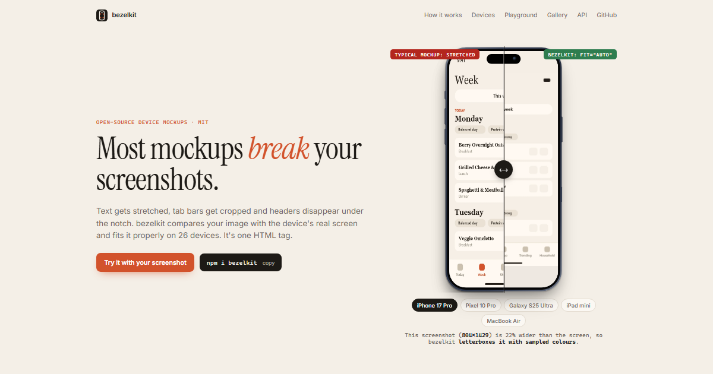

# bezelkit

**Most mockups break your screenshots. bezelkit fixes that.** · [bezelkit.dev](https://bezelkit.dev)

Text gets stretched, tab bars get cropped and headers disappear under the notch. bezelkit compares your image with the device's real screen and fits it properly.

 One zero-dependency web component covering iPhone, Android, iPad, Galaxy Tab, Apple Watch, MacBook, iMac, Studio Display and browser windows.

```html
<script type="module" src="https://cdn.jsdelivr.net/npm/bezelkit@0/dist/bezelkit.js"></script>

<bezel-device device="iphone-17-pro" src="screenshot.png"></bezel-device>
```

That's all you need. It works in plain HTML, React 19, Vue, Svelte, Astro, MDX, Webflow/Framer embeds and Markdown docs sites.

## Why another mockup library?

Most mockups on the web look wrong for the same few reasons:

| Problem | What usually happens | What bezelkit does |
|---|---|---|
| Screenshot shape ≠ frame shape | `width:100%; height:100%` stretches it, or `cover` crops the header/tab bar | `fit="auto"` checks the ratio: **cover** if within 4%, **scroll** for long screenshots, **top** for slightly tall ones, **letterbox** with the image's own edge colours for wide ones |
| Notch/island covers content | The frame is drawn over your UI | `safe-area="pad"` keeps content clear. Slotted HTML gets `--bezel-safe-top/-bottom`, like `env(safe-area-inset-*)` |
| Fixed-pixel frames | You end up with `transform: scale(.43)` and magic numbers | Scales to whatever width (or width *and* height) you give it, and stays vector-sharp |
| Made-up screen sizes | Iframes show a desktop layout squeezed into a phone | Screens use the real **CSS viewport** (402×874 for iPhone 17 Pro), so a 3× screenshot maps 1:1 and embedded sites hit their real breakpoints |
| One framework only | React-only or Tailwind-only packages | A standard custom element. Frameworks just render a tag |

### Landscape (researched Sep 2026)

- [Telephone](https://sneas.github.io/telephone/): a web component with a few phones. It has no fit logic and no laptops or tablets.
- [react-device-mockup](https://github.com/jung-youngmin/react-device-mockup): React only, phones only.
- [Flowbite device mockups](https://flowbite.com/docs/components/device-mockups/): Tailwind snippets with generic shapes, and you size them yourself.
- [CSS-Device-Mockups](https://github.com/callmenick/CSS-Device-Mockups) and devices.css: pure CSS at fixed pixel sizes, with older models.
- Shots.so, MockUPhone and similar generate images, so you can't embed live content.

The gap bezelkit fills: **correct content fitting + real viewports + every device class + framework-agnostic embedding.**

## Attributes

| Attribute | Values | Notes |
|---|---|---|
| `device` | see [devices](#devices) | Aliases: `iphone`, `android`, `pixel`, `galaxy`, `ipad`, `macbook`, `imac`, `watch`, `browser` |
| `src` | image · video · URL | Type is detected from the extension. Force it with `type="image\|video\|iframe"` (needed for `blob:` video). No `src` means your child HTML is slotted in |
| `fit` | `auto` (default) `cover` `top` `contain` `scroll` `fill` `none` | See the table above |
| `color` | finish name or any CSS colour | `color="cosmic-orange"`, `color="#ff5a36"` |
| `orientation` | `portrait` `landscape` | Phones and tablets. Content stays upright |
| `chrome` | `auto` `on` `off` | Synthetic status bar and home indicator. `auto` turns them on for HTML/iframes and off for screenshots, which already have them |
| `safe-area` | `auto` `pad` `none` | `auto` pads HTML/iframes and leaves media full-bleed |
| `theme` | `light` `dark` | Status bar ink, safe-area fill, browser toolbar |
| `url`, `viewport` | `acme.dev`, `1440x900` | Browser frames only |
| `glare` | boolean | Subtle screen reflection |
| `shadow` | `none` | Turns off the drop shadow |
| `alt` | text | Alt text for the image, or a title for the iframe |
| `side` | `front` (default) `back` `both` | `back` draws the rear: camera module, finish and mirrored buttons. `both` is a stacked hero shot with the back tilted behind the front. Not available for browser frames |
| `stack` | `left` (default) `right` | With `side="both"`, the side the back peeks out from. The camera sits top-left on the back, so `left` shows it |
| `logo` | `none` (default) `dot` | Brand logos are never drawn. `dot` adds a neutral placeholder mark on the back |

Every attribute is also a property (`el.safeArea = 'pad'`).

**Read-only properties:** `spec` (the device object), `resolvedFit`, `screenSize`.

**Method:** `el.flip(side?)` turns the device over with an 800 ms 3D turn and returns a Promise that resolves with the new side. With no argument it toggles between `front` and `back`. Setting `side` directly animates the same way. Calling it again mid-turn reverses the turn. With `prefers-reduced-motion`, the side switches instantly.

**Events:** `bezel-fit` fires with `{ requested, fit, media, screen, mediaRatio, screenRatio, mismatch }` once media loads. Use it to flag screenshots that came from the wrong device. `bezel-flip` fires with `{ side }` when a front/back turn settles.

**Styling:** use `::part(frame | screen | content | media | image | video | iframe | back)`, `--bezel-screen-bg` and `--bezel-safe-bg`.

### Sizing tips

- Give it a width (`style="width:320px"`) and the height follows from the device's aspect ratio.
- Give it a width **and** a height and it fits inside that box, centred.
- In CSS Grid, use `minmax(0, 1fr)` columns. Plain `1fr` means `minmax(auto, 1fr)`, so the grid sizes columns from the element's aspect ratio instead of shrinking them.

## Custom devices

```js
import { defineDevice } from 'bezelkit';

defineDevice({
  id: 'my-kiosk', name: 'Kiosk', kind: 'tablet',
  screen: { w: 1080, h: 1920, radius: 0 }, bezel: 40, rim: 6,
  colors: [['Graphite', '#3a3d42']],
});
```

See the schema at the top of [`src/devices.js`](src/devices.js). To give a device a rear view, add a `back: { finish, camera: { plates, parts } }` entry. The renderer needs no changes. Without an entry, the back gets a generic lens and flash.

## Devices

26 frames so far:

- **Phones:** iPhone 17 Pro Max, 17 Pro, Air, 17, 16e, SE · Pixel 10 Pro · Galaxy S25 Ultra, S25 · generic Android
- **Tablets:** iPad Pro 13″/11″, iPad Air 11″, iPad mini · Galaxy Tab S10+
- **Watches:** Apple Watch Ultra, Series 11
- **Laptops and desktops:** MacBook Pro 14″/16″, MacBook Air 13″/15″, generic 1080p laptop · iMac 24″, Studio Display
- **Browser windows:** Chrome-style, Safari-style

Screen sizes come from published CSS-viewport tables. Corner radii, bezels and button positions are measured estimates, and PRs with better numbers are very welcome.

## Develop

No build step. Any static server works:

```bash
python -m http.server 8766
```

Then open `http://localhost:8766` for the playground or `/examples/states.html` for the visual state matrix. `/examples/back.html` shows every back, the flip and stacked compositions.

## Roadmap

- [ ] Verify every spec against official dimensions and add a `verified` flag to each device
- [ ] Foldables (Galaxy Z Fold/Flip, Pixel Fold) with a `folded` attribute
- [ ] Framework wrappers for typed props (`@bezelkit/react`, `@bezelkit/vue`)
- [ ] PNG/SVG export ("download this mockup") in the playground
- [ ] Tests: `resolveFit` unit tests and Playwright visual snapshots of `examples/states.html`
- [ ] Publish to npm and set up a docs site on GitHub Pages or Vercel

## License

MIT. Device names are trademarks of their respective owners. The frames are original CSS drawings, not traced artwork.
